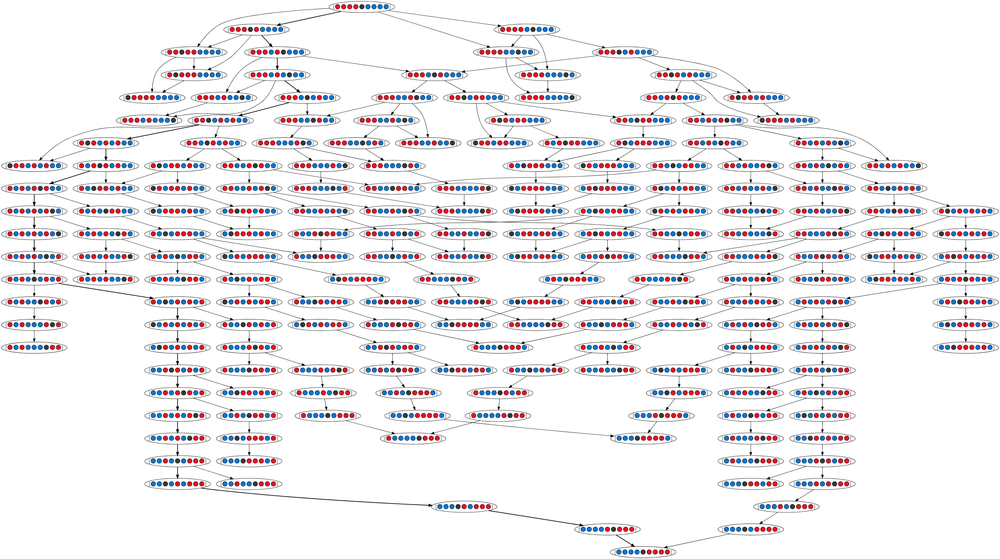

## One Dimensional Peg Solitaire Solver

Puzzle solver for a one dimensional version of peg solitaire my grandad showed me (uses a directed graph to compute all possible moves).


```
Starting peg solver...
Initial state: [RRRREBBBB]
Target state: [BBBBERRRR]
Starting graph generation...
195 possible moves generated (dead ends included)
Contains solution: True
[[RRRREBBBB]->[RRRERBBBB]]
[[RRRERBBBB]->[RRRBREBBB]]
[[RRRBREBBB]->[RRRBRBEBB]]
[[RRRBRBEBB]->[RRRBEBRBB]]
[[RRRBEBRBB]->[RREBRBRBB]]
[[RREBRBRBB]->[RERBRBRBB]]
[[RERBRBRBB]->[RBRERBRBB]]
[[RBRERBRBB]->[RBRBRERBB]]
[[RBRBRERBB]->[RBRBRBREB]]
[[RBRBRBREB]->[RBRBRBRBE]]
[[RBRBRBRBE]->[RBRBRBEBR]]
[[RBRBRBEBR]->[RBRBEBRBR]]
[[RBRBEBRBR]->[RBEBRBRBR]]
[[RBEBRBRBR]->[EBRBRBRBR]]
[[EBRBRBRBR]->[BERBRBRBR]]
[[BERBRBRBR]->[BBRERBRBR]]
[[BBRERBRBR]->[BBRBRERBR]]
[[BBRBRERBR]->[BBRBRBRER]]
[[BBRBRBRER]->[BBRBRBERR]]
[[BBRBRBERR]->[BBRBEBRRR]]
[[BBRBEBRRR]->[BBEBRBRRR]]
[[BBEBRBRRR]->[BBBERBRRR]]
[[BBBERBRRR]->[BBBBRERRR]]
[[BBBBRERRR]->[BBBBERRRR]]
```

#### Solution


#### All 195 moves


### Graphviz
https://www.graphviz.org/doc/info/attrs.html

